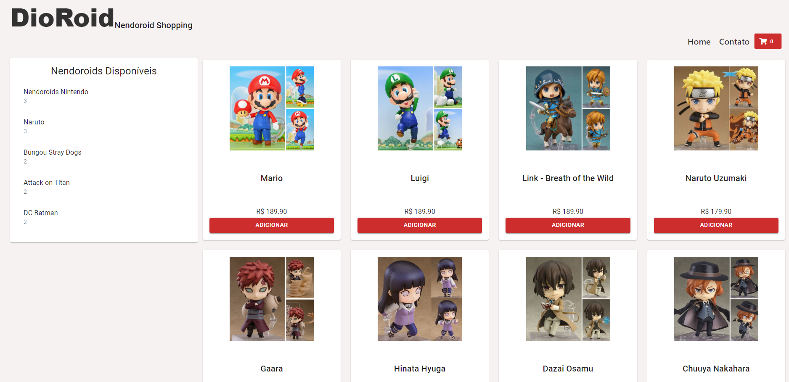

# Projeto de Ecommerce React/Redux

Projeto realizado para o bootcamp Impulso da Digital Innovation One.

<p align="center">
  
 </p>


### Linguagens utilizadas
O projeto tem como propósito criar uma página de ecommerce, para isso foi utilizado:


  ``JavaScript``

  ``ReactJs``
                 
 ``Redux``
                    
 ``CSS``
          

### Nova roupagem
Repaginei o site proposto pela expert Nathally Souza, o transformando em um site de compras de action figures japoneses conhecidos como, Nendoroids.

```shell
Nendoroid [ねんどろいど] são action figures no estilo chibi (cabeçudos), articulados, extremamente 
customizáveis e possuem cerca de 10cm de altura, originalmente fabricados pela Goodsmile Company no 
ano de 2006. A marca Nendoroid abrange uma variedade de produtos diferentes com personagens de animes, 
jogos, mangas, filmes, vocaloid e outros personagens de sucesso. Existem dezenas de marcas que 
tentam imitar os originais nendoroid.
Uma de suas principais vantagens é seu preço baixo em relação aos figma, sua qualidade bem detalhada e 
seu tamanho que ajuda na hora de poupar espaço. Em japonês seu nome pode ser abreviado para nendoro [ねんどろ].
```

Na página, eu preferi fazer um estilo mais simples e limpo para poder chamar mais a atenção aos produtos.

<p align="center">
  
 </p>


### Desafios propostos
No site fiz dois dos desafios propostos pela dev onde:

1. Transformar o nome do site em um link para a HOME
2. Colocar um rodapé/footer no site

### Funcionamento
Assim como instruído pela dev, existe o funcionamento das páginas home e contatos, além da parte de cart.
A app faz a leitura da quantidade de itens expostos e quais categorias cada um faz part, e coloca na coluna de disponíveis. E no cart, aparecem quais produtos estão sendo adicionados, quantos são e fazem a soma do valor total.

#### Páginas e links

<p align="center">
  
 </p>
 
 #### Cart
 <p align="center">
  
 </p>
 
 ## ℹ️ Como Executar

- ### **Pré-requisitos**

  - É **necessário** possuir o **[Node.js](https://nodejs.org/en/)** instalado no computador
  - É **necessário** possuir o **[Git](https://git-scm.com/)** instalado e configurado no computador
  - Também, é **preciso** ter um gerenciador de pacotes seja o **[NPM](https://www.npmjs.com/)** ou **[Yarn](https://yarnpkg.com/)**.

1. Faça um clone do repositório:

```shell
  $ git clone https://github.com/KarimeLinhares/Projeto-Ecommerce-React-Redux.git
```

2. Executando a aplicação

```shell
  $ cd dioshopping-main
  $ yarn ou npm start
```
